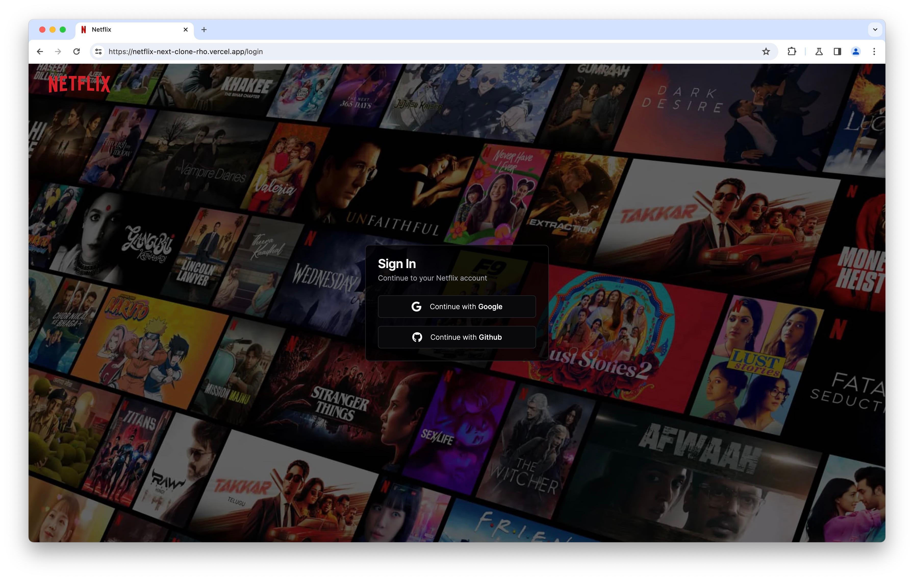
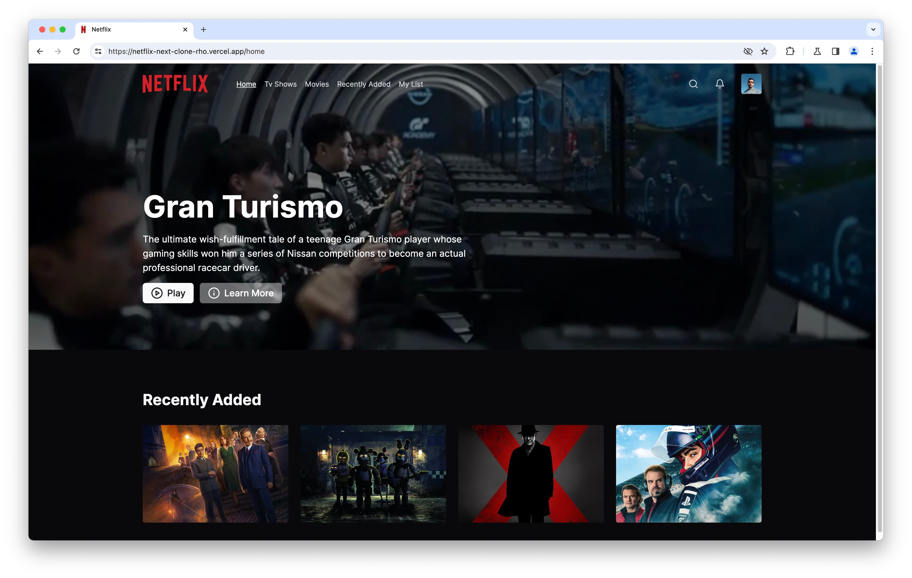

# Netflix Clone

## Overview

Welcome to the Netflix Clone, a project developed using Next.js, Tailwind CSS, and TypeScript. This application replicates an small part of the original website. Just a practice.

## Screenshots




## Tech Stack


## Getting Started

First, clone the repo and move into it:

```bash
git clone https://github.com/frshaad/netflix-clone.git
cd netflix-clone
```

Then, install dependencies:

```bash
npm i
# or
pnpm i
# or
yarn install
```

And run the development server:

```bash
npm run dev
# or
pnpm dev
# or
yarn dev
```

Open [http://localhost:3000](http://localhost:3000) with your browser to see the result.
